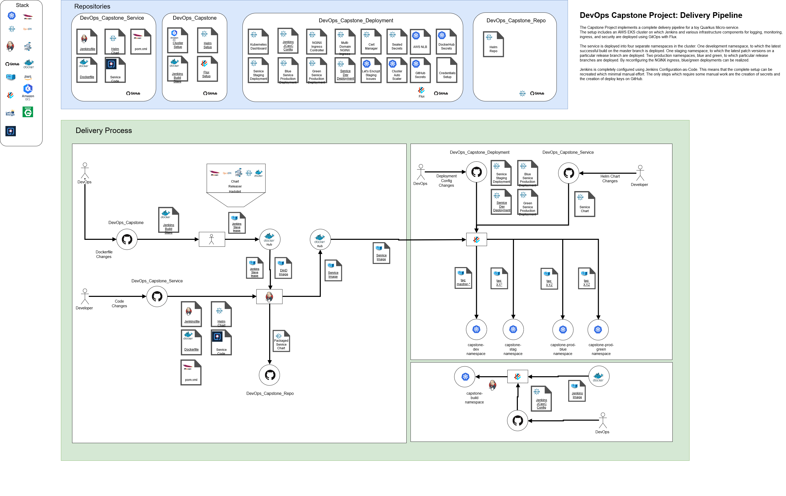

# Repository Overview

This is the main repository for the [Udacity Cloud DevOps Nano Degree](https://www.udacity.com/course/cloud-dev-ops-nanodegree--nd9991).
It contains the documentation and infrastructure setup for the final (capstone) project.

This includes
* Code for setting up infrastructure
  - [AWS EKS](https://aws.amazon.com/de/eks/) cluster setup using [eksctl](https://github.com/weaveworks/eksctl) and shell scripts
  - Scripts for preparing the EKS cluster for [GitOps](https://www.weave.works/technologies/gitops/) using [Flux](https://www.weave.works/oss/flux/) 
  and [Helm](https://helm.sh/)
* Documentation

There are two other repositories 
* [DevOps_Capstone_Deployment](https://github.com/FlorianSeidel/DevOps_Capstone_Deployment):  Contains the Flux deployment config
* [DevOps_Capstone_Service](https://github.com/FlorianSeidel/DevOps_Capstone_Service): Contains a Quarkus toy micro-service and the Jenkins pipeline
* [DevOps_Capstone_Repo](https://github.com/FlorianSeidel/DevOps_Capstone_Repo): Contains a Quarkus toy micro-service and the Jenkins pipeline

# Project Overview

This is a toy CI/CD setup for delivering code changes into a production environment in an automated way.
It is based on Jenkins, AWS EKS, eksctl, Helm, Flux, GitHub, DockerHub and Quarkus.
Infrastructure setup and configuration is mostly automated. This includes the Jenkins configuration and excludes secret generation and authorization steps.

The project contains the following parts:
- A simple toy micro-service built using the [Quarkus](https://quarkus.io/) framework.
- A K8s integrated, Helm based Jenkins setup, configured as code using [Jenkins Configuration As Code](https://jenkins.io/projects/jcasc/) and deployed using GitOps.
- A multi-branch Jenkins pipeline for the toy project, configured using the [Jenkins Jobs DSL](https://jenkinsci.github.io/job-dsl-plugin/).
- A development workflow definition, including branching model (trunk based development), partly enforced by the Jenkinsfile.
- A AWS EKS K8s cluster setup with development, staging and production environments, configured for Blue/Green deployments controlled by Flux. 

See the DevOps_Capstone_Deployment and DevOps_Capstone_Service repos for more details.

#### Future Plans

- Have a look at security aspects. Currently only the bare minimum has been done.
- Replace NAT Gateways with NAT instances to safe costs
- Configure HPA for the Ingress Controller
- Add a second instance of the Ingress Controller running on a different node
- Make setup more generic by adding parameters. Currently GitHub and DockerHub accounts are hard-coded.

# Architecture 

## Big Picture

### Delivery Pipeline

### EKS Cluster

## Development Workflow

# Installation

